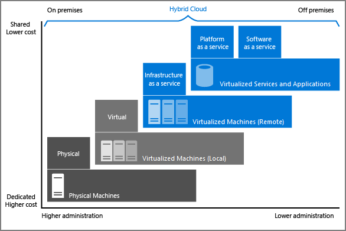

# Core Azure concepts and services

## Cloud computing: Definition, Advantages and Computing models

### What is cloud computing?

- Cloud computing is the on-demand availability of computer system resources, especially **data storage** (cloud storage) and **computing power**, without direct active management by the user. 
- The term is generally used to describe data centers available to many users over the Internet as **services**. These services include servers, storage, databases, networking, software, analytics, and intelligence.

### Cloud computing advantages

- **Reliability:** cloud-based applications can provide a continuous user experience with no apparent downtime (depending on the service level agreement).
- **Scalability:** Applications in the cloud can be scaled in two ways, while taking advantage of autoscaling:
    - Vertically: Computing capacity can be increased by adding RAM or CPU to a virtual machine.
    - Horizontally: Computing capacity can be increased by adding instances of a resource, such as adding more virtual machines to your configuration.
- **Elasticity:** Cloud-based applications can be configured to always have the resources they need (not more not less).
- **Agility:** Cloud-based resources can be deployed and configured quickly as your application requirements change.
- **Geo-distribution:** Applications and data can be deployed to regional datacenters around the globe, so users always have the best performance in their region.
- **Disaster recovery:** By taking advantage of cloud-based backup services, data replication, and geo-distribution, you can deploy your applications with the confidence that data is safe in the event that disaster should occur.

### Cloud service models

These models define the different level of shared responsibility that a cloud provider and cloud tenant are responsible for:

1. **Infrastructure as a service (IaaS):** 
    - A cloud provider keeps the hardware up to date, but operating system maintenance and network configuration is left to the cloud tenant.
    - For example, Azure virtual machines are fully operational virtual compute devices running in Microsoft's datacenters.
2. **Platform as a service (PaaS):** 
    - The cloud provider manages the virtual machines and networking resources, and the cloud tenant deploys their applications into the managed hosting environment.
    -  For example, Azure App Services provides a managed hosting environment where developers can upload their web applications without having to deal with the physical hardware and software requirements.
3. **Software as a service (SaaS):** 
    - In this cloud service model, the cloud provider manages all aspects of the application environment, such as virtual machines, networking resources, data storage, and applications. 
    - The cloud tenant only needs to provide their data to the application managed by the cloud provider. For example, Office 365 provides a fully working version of Office that runs in the cloud. All that you need to do is create your content, and Office 365 takes care of everything else.

This picture gives a summary of this section: As your resources move from on-premises to off-premises, your costs are reduced, and your administration requirements decrease.

## What is Azure and how does it work in the background?

### What is Azure?

- Microsoft Azure, commonly referred to as Azure, is a **cloud computing service** created by Microsoft for building, testing, deploying, and managing applications and services through Microsoft-managed data centers.
- It provides **software as a service (SaaS), platform as a service (PaaS) and infrastructure as a service (IaaS)** and supports many different programming languages, tools, and frameworks, including both Microsoft-specific and third-party software and systems.

### How does Azure work?

- Azure uses **virtualization** which abstracts operating system, application, storage or network away from the true underlying hardware or software. (See more on virtualization doc)
- It does that using an abstraction layer provided by a software called a **hypervisor**, which emulates the functions of a real computer and it's CPU in a **virtual machine**.
- Azure replicates this virtualization process on a massive scale acrosse Microsoft **data centers** across the world:
    - Each data center has multiple racks filled with **servers**.
    - Each server includes a hypervisor to run multiple virtual machines.
    - A **network switch** provides connectivity to all those servers.
    - One server in each rach runs a special piece of software called a **fabric controller**, which is responsible for creating VMs in response to requests.
    - Each fabric controller is connected to another special piece of software called an **orchestrator** (through the switch), which is responsible for managing user requests.
    - Users perform requests using the **orchestrators web API**.
    - The web API can be called by many tools, including the user interface of the **Azure portal** or command-line tools.

## Tour of Azure services

An overview of the most commonly used categories cab be found [here](https://docs.microsoft.com/en-us/learn/modules/intro-to-azure-fundamentals/tour-of-azure-services) 

