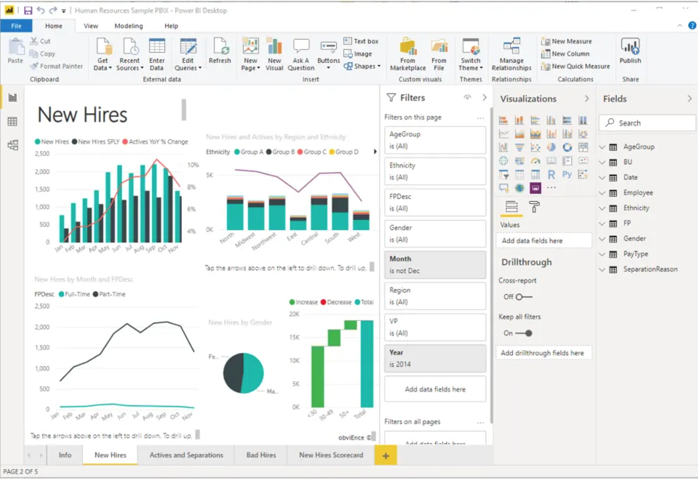
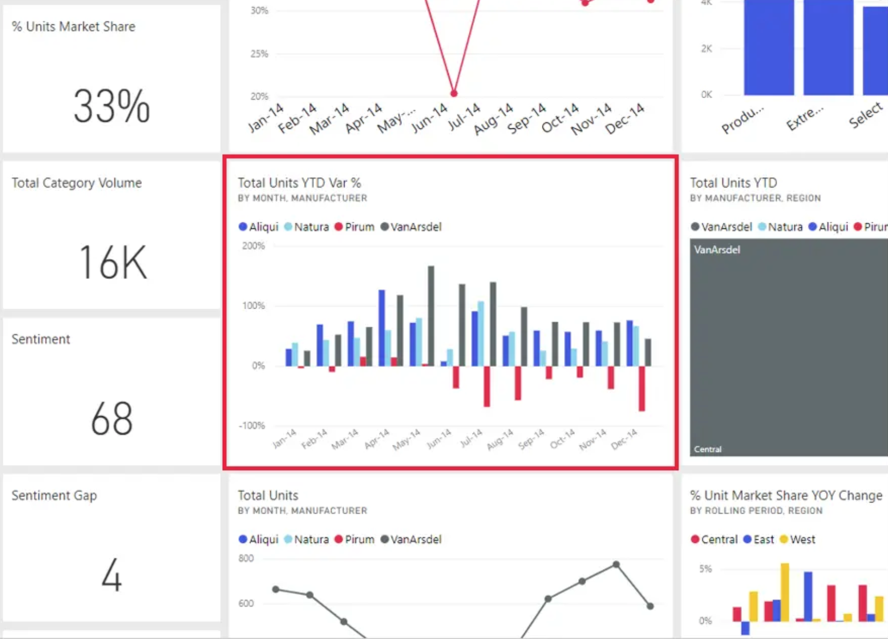

Introduction and getting started with Power BI
==============================================

The parts of Power BI
#####################

Power BI consists of:
- A Microsoft Windows desktop application called **Power BI Desktop**
- An online SaaS (Software as a Service) service called the **Power BI service** 
- Mobile Power BI apps.

A common flow of work in Power BI begins in Power BI Desktop, where a report is created. That report is then published to the Power BI service and finally shared, so that users of Power BI Mobile apps can consume the information.

Basic building blocks of Power BI
#################################

Everything you do in Microsoft Power BI can be broken down into a few basic building blocks. After you understand these building blocks, you can expand on each of them and begin creating elaborate and complex reports. 

Here are the basic building blocks in Power BI:

- Visualizations
- Datasets
- Reports
- Dashboards
- Tiles

Visualizations
--------------

A **visualization** or visual for short is a visual representation of data, like a chart, a color-coded map, or other interesting things you can create to represent your data visually. 
Visualizations can be simple, like a single number that represents something significant, or they can be visually complex, like a gradient-colored map that shows voter sentiment about a certain social issue or concern.

Datasets
--------

A **dataset** is a collection of data that Power BI uses to create its visualizations. 
Datasets can also be a combination of many different sources, which you can filter and combine to provide a unique collection of data for use in Power BI.

Reports
-------

In Power BI, a **report** is a collection of visualizations that appear together on one or more pages. A report can be thought of as a multi-page dashboard.

Here is an example of a report with multiple pages:

Dashboards
----------

When you're ready to share a single page from a report, or a collection of visualizations, you create a **dashboard**. Often, it's a selected group of visuals that provide quick insight into the data or story you're trying to present.

A dashboard must fit on a single page, often called a **canvas** (the canvas is the blank backdrop in Power BI Desktop or the service, where you put visualizations).

Tiles
-----

In Power BI, a **tile** is a single visualization on a report or a dashboard. It's the rectangular box that holds an individual visual.

A tile is shown in red in the dashboard below:

