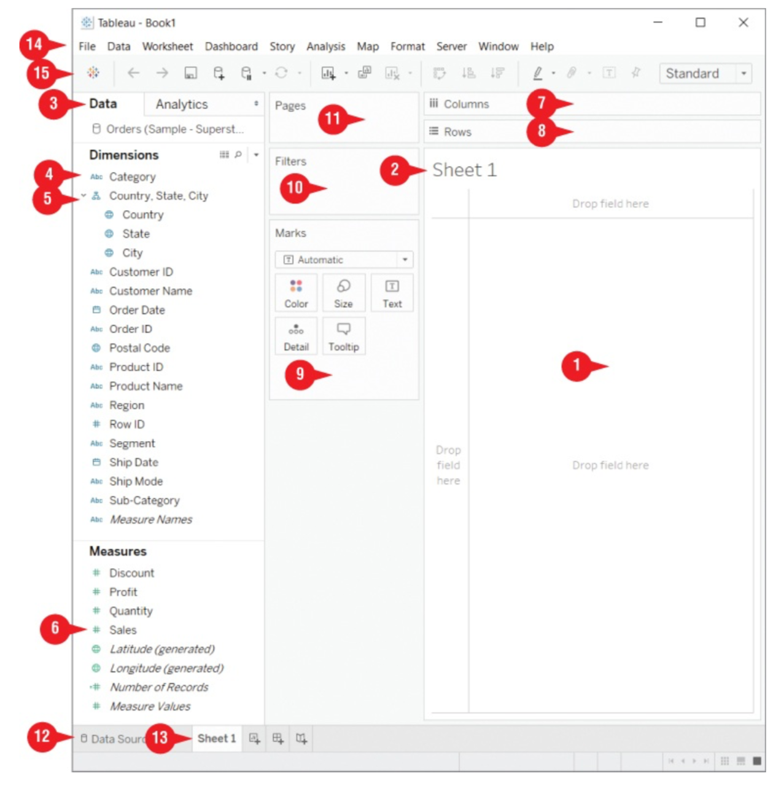

Introduction and getting started with Tableau
=============================================

There are many different Tableau products: - Tableau Desktop: An
application for Windows and Mac, this is what we will be exploring here.
- Tableau Prep: Used to prepare data (cleaning, correctly formatting,
etc) data before exploring it in Tableau Desktop. - Tableau Server:
Platform for data analysis for companies. - Tableau Online: Cloud-based
Tableau-hosted solution for hosting and deploying dashboards. - Tableau
Public: Hosting service for the publication of data visualizations to
the web, used by bloggers and newsrooms. - Tableau Reader: Free desktop
app to interact with Tableau workbook files.

Here we will focus on Tableau Desktop. Details about the Tableau
application suite as well as instructions for installing Tableau Desktop
can be found in Chapter 1 of the book.

Data preparation
----------------

There are certain requirements a dataset should meet for easy use in
Tableau. The most important of these requirements is to **use raw data**
as much as possible: We prefer long tables with a single data point in
each row to wide tables with aggregated mesaures like averages etc. We
want raw data, averages and other measures can be computed later using
Tableau.

If the dataset you are presented with is not in this raw format, you
should modify it to make it as raw as possible before proceeding to
uploading it to Tableau.

The sample dataset
------------------

Located in
``C:\Users\My_user\Documents\My Tableau Repository\Datasources\2020.3\en_US-US``
or a similar path, the sample dataset ``Sample - Superstore.xls``
contains three sheets ``Orders``, ``People`` and ``Returns`` of a
fictuous company. We will use this dataset to get along with Tableau
Desktop features.

First open the Excel file, click on the ``Orders`` sheet and then launch
a new Tableau worksheet by clicking on ``Sheet 1`` Tab in the bottom.

The Tableau workspace
---------------------

Here we explore the most important elements of the Tableau interface
when you open a worksheet. These are numbered from 1 to 15 in the figure below:

1.  **The canvas:** where ou can drag and drop dimensions and measures
    to visualize them.
2.  **The Title of the worksheet**
3.  **Data Pane and Analytics Pane:** The Data Pane includes Dimensions
    and Measures, and the Analytics Pane will be discussed in greater
    detail in Chapter 7 of the book and we won’t be able to cover that
    here.
4.  **Dimensions:** Categorical (non-numerical) data.
5.  **Hiearchical dimensions:** Hiearchical categorical data (ex:
    country, state, city).
6.  **Measures:** Numerical data.
7.  **Columns:** The columns of the visualization, dragging dimensions
    or measures here is the same as dragging them in the vertical area
    to the left side of the canvas.
8.  **Rows:** The rows of the visualization, dragging dimensions or
    measures here is the same as dragging them in the horizontal area to
    top of the canvas.
9.  **Marks:** Used for changing color, size or showing a tooltip wth a
    certain measure or dimension. Fields from the data pane (dimensions
    and measures) can also be dragged here. For example, dragging the
    Segment dimension into the color pane colors the graph based on
    segment. Tooltips are little messages that appear when you hover on
    one of the sections in the graph.
10. **Filters:**\ You can drag a field from the data pane here as well
    to filter data to be visualized by a certain rule on that field.
11. **Pages:** To Document
12. **Data Source:** Get back to the Data Source Tab to potentially add
    new sources of data.
13. **Sheet 1**: You can design multiple data visualizations in
    different sheets in parallel.
14. **The Menu Bar:** To Document (page 36-37 of the book)
15. **The Toolbar:** The toolbar contains three important buttons:

    -  The Tableau icon to go back to the start screen.
    -  The Undo button to cancel changes made in the worksheet.
    -  The Redo button to redo what you cancelled.

Working with measures and dimensions
------------------------------------

Working with marks
------------------

Saving, opening and sharing workbooks
-------------------------------------
