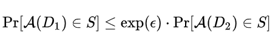

# Perturbation Approaches

- **Differential privacy:** In this section we focus on Differential Privacy techniques which resist membership inference attacks by **adding random noise** to the input data (input perturbation), to iterations in a certain algorithm (algorithm perturbation), or to the algorithm output (output perturbation).
- **Local differential privacy:** While most DP approaches assume a trusted aggregator of the data, local differential privacy allows each input party to add the noise locally; thus, requiring no trusted server.
- **Dimensionally reduction:** perturbs the data by projecting it to a lower dimensional hyperplane to prevent reconstructing the original data, and/or to restrict inference of sensitive information. 

## Differential Privacy (DP)

- Differential privacy is a system for publicly sharing information about a dataset by describing the patterns of groups within the dataset while withholding information about individuals in the dataset.
- The idea behind differential privacy is that if the effect of making an arbitrary single substitution in the database is small enough, the query result cannot be used to infer much about any single individual, and therefore provides privacy.
- Roughly, an algorithm is differentially private if an observer seeing its output cannot tell if a particular individual's information was used in the computation.

### 𝜀-Differential privacy mathematical definition

A randomized algorithm A is 𝜀-differentially private if for all S in the range of M, and for all data sets D_1 and D_2 differing in one record only: 

### Types of DP

- Input Perturbation

- Algorithm Perturbation

- Output Perturbation

- Objective perturbation

## Local Differential Privacy

When the input parties do not have enough information to train a ML model, it might be better to utilize approaches that rely on local differential privacy (LDP). With LDP, each input party would perturb their data, and only release this obscure view of the data.

## Dimensionality Reduction (DR)

- Perturbs the data by projecting it to a **lower dimensional** hyperplane. 
- This **enhances the privacy**, since retrieving the exact original data from a reduced dimension version would not be possible (the possible solutions are infinite as the number of equations is less than the number of unknowns).
- But such transformation is **lossy**.
- Examples: DR techniques such as principal component analysis (PCA), discriminant component analysis (DCA), and multidimensional scaling (MDS) are used to find the best projection matrix for utility purposes, while relying on the reduced dimensionality aspect to enhance the privacy.