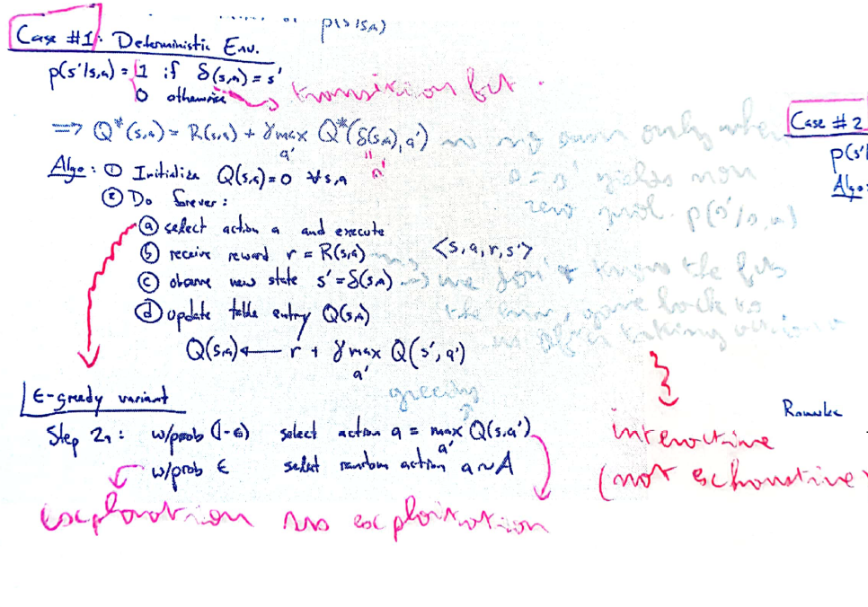
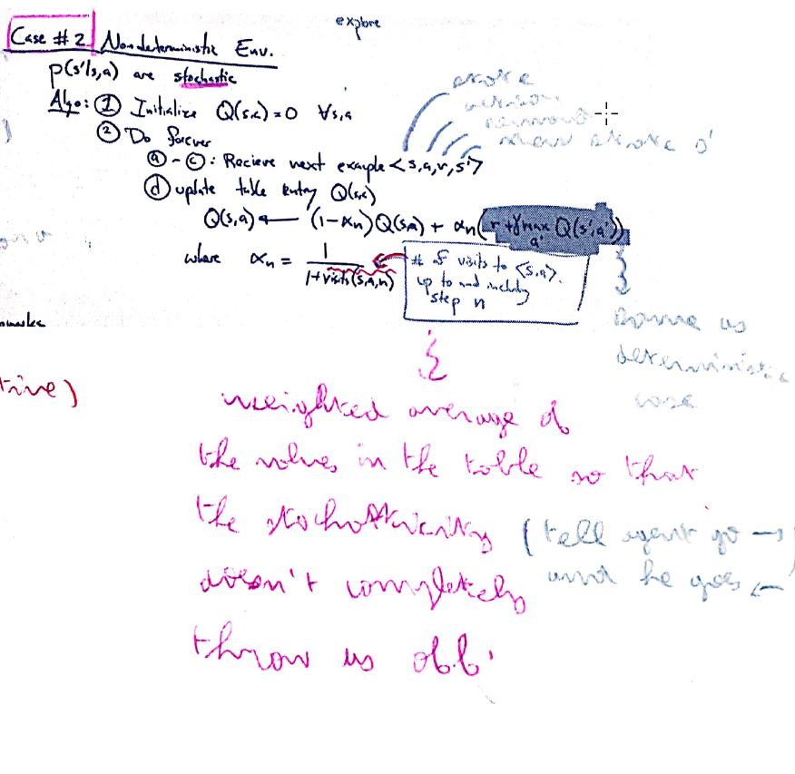
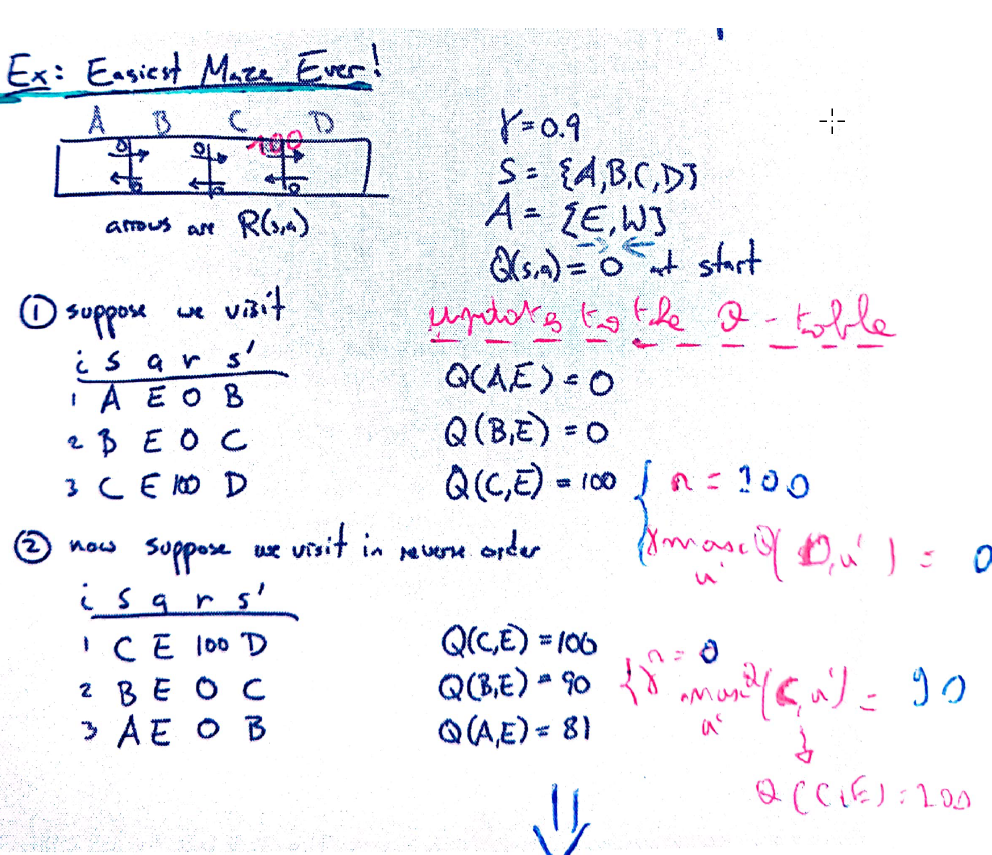

Q_learning (continued)
######################

Q-Learning Algorithm
********************

The goal is to populate the Q-tables. There are two cases, the deterministic case and the non-deterministic case (where the transitions are stochastic).

The deterministic case Q_learning algorithm:

The non-deterministic case Q_learning algorithm:

Example: Q-learning in action
*****************************

